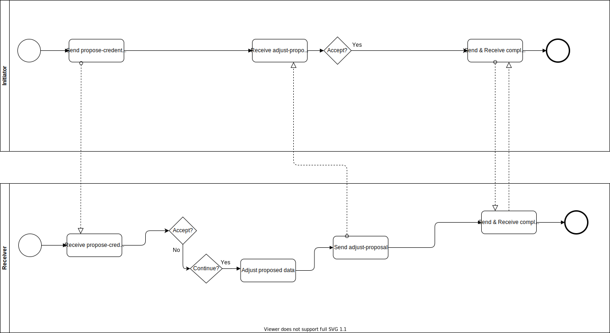
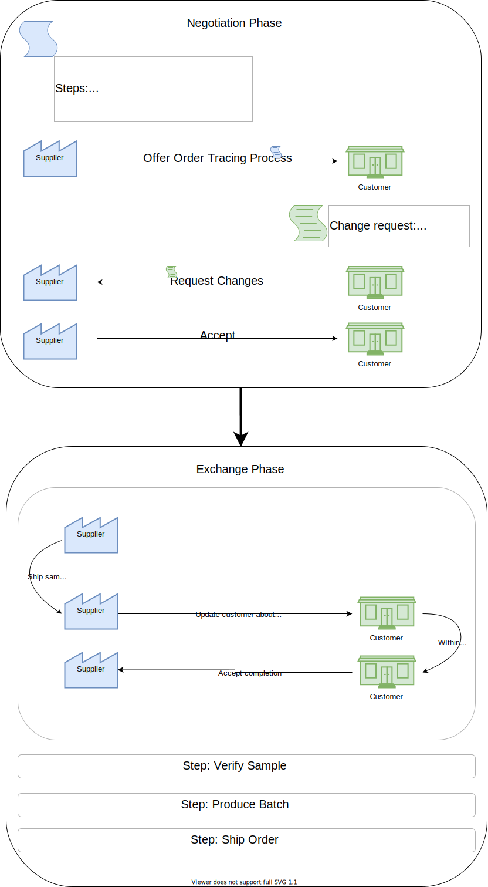

# Negotiated Credential Exchange

## Summary
This document describes the Negotiated Credential Exchange (NCE), a two-party workflow for jointly conducting exchanges of [verifiable credentials](https://www.w3.org/TR/vc-data-model).

## Motivation

We want to introduce a standardized way for two parties to exchange credentials bidirectionally within different contexts.

It follows a description of a decentralized, lightweight, and customizable workflow enabling these two parties to jointly conduct this process.

## Roles
Negotiated Credential Exchange uses two roles: the initiator and the receiver.

This workflow assumes that these two parties have already established an communication channel (e.g. via [DIDComm](https://github.com/hyperledger/aries-rfcs/tree/master/concepts/0005-didcomm)).  
The initiator is the party that initiates the credential exchange with a credential exchange proposal. They send a list of expected credentials, organized in contexts, to the receiver to arrange an agreement about the exchange process.  
The receiver is the party that receives such an initial credential exchange proposal and is expected to either agree to the proposed terms or make a counter-proposal.

## Tutorial
Negotiated Credential Exchange has two distinct phases:
1. Negotation Phase
2. Exchange Phase

### Negotiation Phase
In this initial phase, the two parties negotiate various aspects about the credential exchange process:
- One or more **contexts** requested credentials are associated to
- The party **responsible** for providing the data for each context respectively
- List of **credentials** per context that the receiving party is expecting, each marked as either 'required' or 'optional'
- Additional **properties** associated with individual contexts
- Additional **properties** associated with the whole exchange

The initial proposer may also provide information that is non-negotiable in an **attributes** field.

The negotiation phase can be initiated by any of the two parties. It consists of at least one round of proposal and answer. The answer can be either a `complete-proposal`, if the receiver agrees to the proposed terms, or an `adjust-proposal`, if the receiver wants to adjust the proposal. The initial proposer can then decide to either agree to the adjustment with a `complete-proposal` or send another `adjust-proposal`. Exchanging `adjust-proposal` messages can happen arbitrarily often until both parties agree to the terms or one party returns an error and exits the negotiation.

### Exchange Phase
In the exchange phase, the two parties proceed to share the credentials with the other party within the contexts they are responsible for, respectively. Contexts can either be updated sequentially or in parallel. NCE does not take care of enforcing any particular order of sharing credentials, making the participants responsible for enforcing the correct order of the contexts being processed, if required. Sharing credentials within a context is done via context update messages. The receiving party can either accept the context update or reject it with a reason the other party can understand and act on.

## Workflow

### Negotiate Credential Exchange
The following flowchart pictures the different stages and messages of the negotiation phase.
  


As this chart might be hard to read at first, the following flowchart pictures the happy path of a negotiation with one round of `propose` and `adjust`.  


#### Propose Credential Exchange
  - Initiator sends a credential exchange proposal to the receiver.
  - This includes DIDCOMM properties (message id and message type). Optionally, it may include any property to be associated with the exchange.
    - For example, the initiator can include proposed deadlines for the context.
  - For each credential the necessary data is added to allow the other party to provide these credentials. That at least involves specifying the desired schema, but may include other things, e.g. a proof request when working with (anonCreds)[https://github.com/hyperledger/ursa]
  - An `attributes` property provides contextual information about the exchange and is not up for negotiation
  - Sample: 
  ```JSONC
  {
    "@id": "<uuid>", // message ID
    "@type": "negotiated-credential-exchange/1.0/propose-credential-exchange",
    "propose-credential-exchange~attach": {
      "mime-type": "application/json",
      "data": {
        "attributes": {
          "title": "Initial Data Exchange",
          "message": "Please share information with me",
          "type": "csr-exchange",
          "respondUntil": "2020-10-23T00:00:00Z"
        },       
        "properties": {
          "anyProperty": "anyValue"
        },
        "contexts": [
          {
            "name": "Environmental Certificates", // fetched from template
            "responsible": "<DID of receiver>",
            "properties": {
              "dueDate": "2021-01-01T00:00:00Z", // Optional
            },
            "credentials": [
              {
                "required": true,
                "schema": "did:evan:schema:0x1234512345123451234512345123451234512345",
              },
            ]
          }
        ]
      }
    }
  }
  ```

#### Adjust Proposal
  - Sending an `adjust-proposal` message serves the purpose of suggesting changes to the proposed credential exchange
  - If the receiver deems the proposal unacceptable and does not want to change it, they can also send an error, exiting the exchange.
  - Sample:
  ```JSONC
  {
    "@id": "<uuid>",
    "~thread": {
      "thid": "<uuid of proposal-message>"
    },
    "@type": "negotiated-credential-exchange/1.0/adjust-proposal",
    "adjust-proposal~attach": {
      "mime-type": "application/json",
      "data": {
        "properties": {
          "anyProperty": "anyValue"
        },
        "contexts": [
          {
            "name": "Environmental Certificates",
            "responsible": "<DID of receiver>",
            "properties": {
              "dueDate": "2020-01-01T00:00:00Z",
            },
            "credentials": [
              {
                "required": true,
                "schema": "did:evan:schema:0x6789067890678906789067890678906789067890", // Receiver can only provide different schema
              }
            ]
          }
          // Other contexts...
        ]
      }
    }    
  }
  ```

#### Complete Proposal
  - If the receiver is accepting the initiator's proposal, they send a `complete-proposal` message and complete the negotiation phase.
  - If the receiver decides to propose adjustements, the initiator receives an `adjust-proposal`. If they accept, they send a `complete-proposal` message to the receiver.
  - If the initiator does not accept, they might send another `adjust-proposal` message or send an error message and exit the exchange.
  - If each party both sent & received a `complete-proposal` message, the negotiation phase is done.
  - Each party appends a VC to their `complete-proposal` message, committing to the negotiated terms.
  - Each party checks if the VC they have received from the other party is valid and holds the negotiated terms.
  ```JSONC
  {
    "@id": "<uuid>",
    "~thread": {
      "thid": "<uuid of proposal-message>"
    },
    "@type": "negotiated-credential-exchange/1.0/complete-proposal",
    "complete-proposal~attach": { // Optional
      "mime-type": "application/json",
      "data": {
        // ... Attach VC Data
      }
    }
  }
  ```

### Updates


#### Update context

- The party responsible for a context can update it by sending a `update-context` message, e.g. providing a required credential.
  ```JSONC
  {
    "@id": "<uuid>",
    "~thread": {
      "thid": "<uuid of proposal-message>"
    },
    "@type": "negotiated-credential-exchange/1.0/update-context",
    "update-context~attach": {
      "mime-type": "application/json",
      "data": {
        "contexts": [
          {
            "name": "Environmental Certificates",
            "properties": {
              "status": "complete"
            },
            "credentials": [
              {
                // Credential payload                 
              }
            ]
          }
        ]
      }
    }
  }
  ```

#### Accept / Reject update
- The other party may accept this update.
  ```JSONC
  {
    "@id": "<uuid>",
    "~thread": {
      "thid": "<uuid of proposal-message>"
    },
    "@type": "negotiated-credential-exchange/1.0/accept-update",
  }
  ```

- Or initiator may request additional payload or criteria being met.
```JSONC
  {
    "@id": "<uuid>",
    "~thread": {
      "thid": "<uuid of proposal-message>"
    },
    "@type": "negotiated-credential-exchange/1.0/reject-update",
    "updateId": "<uuid of update-context message>",
    "reason": "Credential is revoked",
    "reject-update~attach":  {
      "mime-type": "application/json",
      "data": {
        // Further optional payload, e.g. explaining rejection
      }
    }
  }
```

- **NOTE**: Accepting a state update may also be conditional, e.g. when payment is expected. For this, [payment decorators](https://github.com/hyperledger/aries-rfcs/tree/master/features/0075-payment-decorators) may be used. 

## Example

In this short example, we imagine two parties, the fashion seller Francis and their supplier of textiles, Sam. Francis wants to order new shirts from Sam. Beforehand, Francis wants to receive a product sample, verify the quality and then order a batch of shirts. For the whole process, Francis wants to observe and track the status of their order. Therefore, the contexts in the excgabge resemble the steps necessary to complete the order tracing process.


### Negotiation Phase  

Francis sends an order tracing proposal to Sam. This proposal contains the contexts Sam needs to go through in order to complete Francis' order. 
Francis states the ID of the order and demands Sam responds until the end of the workday of February 1st. Sam's message looks like the following:  

```JSONC 
  {
    "@id": "c4d61e49-73b0-4ff4-a76c-3cc2f0d28e69",
    "@type": "negotiated-credential-exchange/1.0/propose-credential-exchange",
    "propose-credential-exchange~attach": {
      "mime-type": "application/json",
      "attributes": {
        "title": "Order Tracing Francis - Sam",
        "orderNo": "1923754153229",
        "respondUntil": "2020-02-01T17:00:00Z"
      },
      "data": {
        "contexts": [
          {
            "name": "Send product sample",
            "properties": {
              "dueDate": "2020-03-01T17:00:00Z",
              "status": "pending"
            },
            "responsible": "did:evan:0x7d6827dEaa1f6d1F8Cf2A72b144e124DB63C0221",
            "credentials": [
              {
                "required": true,
                "proofRequest": {
                  "schema": "<DID of credential template send-product-sample>",
                  "type": "Ed25519Signature2020"
                  // Other proof request properties
                }
              }
            ]
          },
          {
            "name": "Verify quality",
            "properties": {
              "dueDate": "2020-03-15T17:00:00Z",
              "status": "pending"
            },
            "responsible": "did:evan:0x48844deCd9702EDeF6E4e8E8B35092f58D4D8FbF", // DID of customer
            "credentials": [
              {
                "required": true,
                "schema": "<DID of credential template verify-quality>"
              }
            ]
          },
          {
            "name": "Produce batch",
            "properties": {
              "dueDate": "2020-03-22T17:00:00Z",
              "status": "pending"
            },
            "responsible": "did:evan:0x7d6827dEaa1f6d1F8Cf2A72b144e124DB63C0221",
            "credentials": [
              {
                "required": true,
                "schema": "<DID of credential template produce-batch>"
              }
            ]
          },
          {
            "name": "Ship order",
            "properties": {
              "dueDate": "2020-04-05T17:00:00Z",
              "status": "pending"
            },
            "responsible": "did:evan:0x7d6827dEaa1f6d1F8Cf2A72b144e124DB63C0221",
            "credentials": [
              {
                "required": true,
                "schema": "<DID of credential template ship-order>"
              }
            ]
          }
        ]
      }
    }
  }
  ```

Francis, however, does not agree on the due date of the final delivery and demands it to be less far in the future.

```JSONC 
  {
    "@id": "0c1e92a8-7aee-420f-86ac-912d66c2a9a7",
    "~thread": {
      "thid": "c4d61e49-73b0-4ff4-a76c-3cc2f0d28e69"
    },
    "@type": "negotiated-credential-exchange/1.0/adjust-proposal",
    "adjust-proposal~attach": {
      "mime-type": "application/json",
      "data": {
        "contexts": [
          {
            "name": "Send product sample",
            "properties": {
              "dueDate": "2020-03-01T17:00:00Z",
              "status": "pending"
            },
            "responsible": "did:evan:0x7d6827dEaa1f6d1F8Cf2A72b144e124DB63C0221",
            "credentials": [
              {
                "required": true,
                "schema": "<DID of credential template send-product-sample>"
              }
            ]
          },
          {
            "name": "Verify quality",
            "properties": {
              "dueDate": "2020-03-15T17:00:00Z",
              "status": "pending"
            },
            "responsible": "did:evan:0x48844deCd9702EDeF6E4e8E8B35092f58D4D8FbF", // DID of customer
            "credentials": [
              {
                "required": true,
                "schema": "<DID of credential template verify-quality>"
              }
            ]
          },
          {
            "name": "Produce batch",
            "properties": {
              "dueDate": "2020-03-22T17:00:00Z",
              "status": "pending"
            },
            "responsible": "did:evan:0x7d6827dEaa1f6d1F8Cf2A72b144e124DB63C0221",
            "credentials": [
              {
                "required": true,
                "schema": "<DID of credential template produce-batch>"
              }
            ]
          },
          {
            "name": "Ship order",
            "properties": {
              "dueDate": "2020-03-29T17:00:00Z", // Ship earlier!
              "status": "pending"
            },
            "responsible": "did:evan:0x7d6827dEaa1f6d1F8Cf2A72b144e124DB63C0221",
            "credentials": [
              {
                "required": true,
                "schema": "<DID of credential template ship-order>"
              }
            ]
          }
        ]
      }
    }
  }
  ```

Sam agrees to the modified terms and issues a VC committing to them.

```JSONC
  {
    "@id": "f38e9181-393e-40a0-b0ec-3a57b8f9ca42",
    "~thread": {
      "thid": "c4d61e49-73b0-4ff4-a76c-3cc2f0d28e69"
    },
    "@type": "negotiated-credential-exchange/1.0/complete-proposal",
    "complete-proposal~attach": {
      "mime-type": "application/json",
      "data": {
        // VC
      }
    }
  }
  ```

Francis receives the `complete-proposal` message, issues a VC themself and sends a `complete-proposal` back to Sam, attaching their VC.

This marks the completion of the negotiation phase.

### Exchange phase

Sam notifies Francis as soon as they have sent the sample to Francis. As a proof Sam appends a shipment receipt.

```JSONC
  {
    "@id": "e0590c1d-da87-4ec8-bd55-928ac67cfcd8",
    "~thread": {
      "thid": "c4d61e49-73b0-4ff4-a76c-3cc2f0d28e69"
    },
    "@type": "negotiated-credential-exchange/1.0/update-context",
    "update-context~attach": {
      "mime-type": "application/json",
      "data": {
        "contexts": [
          {
            "contextName": "Send product sample",
            "properties": {
              "status": "complete"
            },
            "credentials": [
              {
                // Credential for Shipment Receipt
                "schema": "<DID of credential template send-product-sample>",
                "proof": { /*...*/ }                
              }
            ]
          }
        ]
      }
    }
  }
```

Francis accepts Sam's status update.

```JSONC
  {
    "@id": "325f92bf-620a-46cc-9ad6-6de5ea5fa46b",
    "~thread": {
      "thid": "c4d61e49-73b0-4ff4-a76c-3cc2f0d28e69"
    },
    "@type": "negotiated-credential-exchange/1.0/accept-update",
    "updateId": "e0590c1d-da87-4ec8-bd55-928ac67cfcd8",
  }
```

Next, Francis verifies the received sample's quality. Francis is satisfied and approves the verification context.

```JSONC
  {
    "@id": "a1524eca-9bf8-4133-825e-c3d0dc325d43",
    "~thread": {
      "thid": "c4d61e49-73b0-4ff4-a76c-3cc2f0d28e69"
    },
    "@type": "negotiated-credential-exchange/1.0/update-context",
    "update-context~attach": {
      "mime-type": "application/json",
      "data": {
        "contextName": "Verify quality",
        "properties": {
          "status": "complete"
        }
      }
    }
  }
```

Next, in the same manner Sam goes through the last two remaining steps and Francis approves Sam's step updates.
Once all steps have the status `complete`, the process is considered completed.


## Open Questions & To Dos
- Revisit negotiation phase and improve data exchange. It would probably be better to only send parts of the data
the proposal receiver does not agree with / wants to change instead of them sending back the whole proposal in an
altered form.
- Dictate proof [request] format or leave it open?
